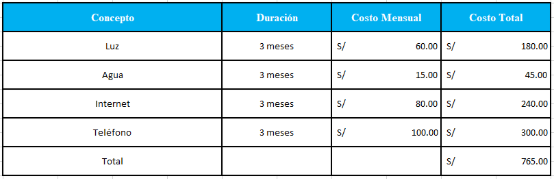



**UNIVERSIDAD PRIVADA DE TACNA**

**FACULTAD DE INGENIERÍA**

**Escuela Profesional de Ingeniería de Sistemas**
**\
\

` `**“Proyecto *EvoLearn”***

**Curso:** 

*Patrones de Software*

**Docente:** 

*Mag. Patrick Cuadros Quiroga*\

**Integrantes:**

*Akhtar Oviedo, Ahmed Hasan		-	(2022074261)*

*Anampa Pancca, David Jordan		-	(2022074268)*

*Salas Jimenez, Walter Emmanuel 	-	(2022073896)*

**Tacna – Perú**

*2025*

` `**Proyecto *EvoLearn***

**Informe de Factibilidad**

**Versión *1.0***

|CONTROL DE VERSIONES||||||
| :-: | :- | :- | :- | :- | :- |
|Versión|Hecha por|Revisada por|Aprobada por|Fecha|Motivo|
|1\.0|AAHV, DDAP, WESJ|PCQ||11/09/2025|Versión Original|

# **Índice General**

[**Índice General	3**](#_heading=h.4f9znqrog2m3)

[1. Descripción del Proyecto	5](#_heading=h.hq1c0ump1ufz)

[1.1 Nombre del proyecto	5](#_heading=h.6w6b1w1n6v46)

[1.4.1 Objetivo general	6](#_heading=h.mx4428hrnc7)

[1.4.2 Objetivos Específicos	6](#_heading=h.tuacz3q1nlk7)

[2. Riesgos	7](#_heading=h.yuoabkv56yym)

[3. Análisis de la Situación actual	7](#_heading=h.ol788gbxj68s)

[3.1 Planteamiento del problema	7](#_heading=h.579qju1w3pxh)

[3.2 Consideraciones de hardware y software	8](#_heading=h.44cino8u7t2z)

[4. Estudio de Factibilidad	9](#_heading=h.nay0uioylif5)

[Actividades realizadas:	9](#_heading=h.iawy8y945v3e)

[4.1 Factibilidad Técnica	9](#_heading=h.90lp2p9cxjg0)

[4.2 Factibilidad Económica	10](#_heading=h.1goal0xyqxe)

[4.2.1 Costos Generales	10](#_heading=h.4onx8sgxqghk)

[4.2.2 Costos operativos durante el desarrollo	10](#_heading=h.xrm0gsevh86f)

[4.2.3 Costos del ambiente	11](#_heading=h.rwml6ayopr76)

[4.2.4 Costos de personal	11](#_heading=h.tcffs0pqqt5e)

[4.2.5 Costos totales del desarrollo del sistema	12](#_heading=h.upolkdf5b07j)

[4.3 Factibilidad Operativa	12](#_heading=h.inpa2e3ajblt)

[4.4 Factibilidad Legal	13](#_heading=h.gfn5j95ndmuz)

[4.5 Factibilidad Social	13](#_heading=h.a7zcw4kuoqx5)

[4.6 Factibilidad Ambiental	14](#_heading=h.qtp9j4x1yze6)

[5. Análisis Financiero	15](#_heading=h.cmr1ta2wmsi)

[5.1 Justificación de la Inversión	16](#_heading=h.fdn9mvpmev5c)

[5.1.1 Beneficios del Proyecto	16](#_heading=h.xo8xp19pv6qf)

[a) Beneficios Tangibles	16](#_heading=h.w4yzisnoabbz)

[b) Beneficios Intangibles	16](#_heading=h.rpsi8kyzx1nt)

[5.1.2 Criterios de Inversión	17](#_heading=h.wde242yrwzc9)

[6. Conclusiones	20](#_heading=h.dyzjm1dg4031)

**Informe de Factibilidad**

1. **Descripción del Proyecto**\

   ==================================================================
   1. ## **Nombre del proyecto**
`	     `EvoLearn	

1. **Duración del proyecto**

4 meses.

1. **Descripción** \

El sistema EvoLearn será implementado como una aplicación móvil para Android que actúa como una solución tecnológica integral para optimizar el ciclo de estudio y repaso de los estudiantes. Actualmente, muchos estudiantes enfrentan un proceso fragmentado, donde la organización de PDFs, la elaboración de resúmenes y la autoevaluación se realizan de forma manual y con herramientas separadas, generando ineficiencias y pérdida de tiempo.

EvoLearn propone un entorno organizado e impulsado por IA que centraliza estas fases en un solo marco de trabajo. A través de un sistema de directorios flexible, los usuarios pueden subir archivos exclusivamente en formato PDF. El sistema integrará una capacidad de análisis de IA que genera resúmenes (generales o detallados) en formato .md y una función de quiz interactivo con revisión de respuestas y justificación. La aplicación garantizará un flujo de estudio coherente y de fácil uso. La infraestructura se apoyará en una arquitectura móvil (Android), con una interfaz clara y una lógica de negocio que gestiona la organización de archivos y la comunicación con el modelo de IA. El proyecto busca no solo optimizar la productividad del estudio, sino también aportar un valor pedagógico significativo, permitiendo a los estudiantes experimentar un ciclo de aprendizaje activo y realista. De esta forma, EvoLearn se posiciona como una herramienta esencial para reducir la dificultad de repasar y realizar resúmenes, facilitando una mejor comprensión de los temas.

1. **Objetivos**\

   1. ### **Objetivo general**
Desarrollar una aplicación móvil Android que facilite la organización, análisis y autoevaluación del material de estudio digital (PDF), automatizando la generación de resúmenes y quizzes mediante el uso de la Inteligencia Artificial.
1. **Objetivos Específicos**\

   ---------------------------------------------------------------
- **Implementar** un sistema de autenticación (registro e inicio de sesión) seguro para el acceso de los usuarios.
- **Diseñar** una interfaz móvil intuitiva en Android que permita la gestión de directorios y la subida de archivos PDF.
- **Integrar** la funcionalidad de análisis de contenido mediante un modelo de IA para **automatizar la generación de resúmenes** (generales o detallados) en formato .md.
- **Implementar** la capacidad de generar y administrar un **quiz** interactivo basado en el contenido de los archivos de resumen.
- **Diseñar** el flujo de evaluación para que el usuario pueda responder el quiz, revisar sus respuestas y obtener la **justificación** ("el porqué") de las correctas.
- **Desarrollar** la lógica de gestión de archivos que permita al usuario **mover, editar el nombre y eliminar** directorios, PDFs y archivos de resumen (**.md**).

# **
1. **Riesgos**\

   =================================================
- **Resistencia a la Adopción:** La resistencia inicial de los usuarios a migrar desde métodos de estudio tradicionales (resúmenes manuales, *apps* de notas simples) podría afectar la adopción de la plataforma, si no se percibe un valor significativo y tangible en el resumen por IA.
- **Complejidad de Integración IA:** La integración del modelo de Inteligencia Artificial para el análisis de PDFs, el resumen y la generación de quizzes puede generar complejidad técnica, requiriendo un *backend* robusto y estable, lo que podría causar retrasos en el desarrollo.
- **Fiabilidad del Contenido Generado:** El rendimiento del sistema puede verse afectado por la precisión y la calidad de los resúmenes y preguntas generadas por la IA, lo que podría comprometer la confianza del estudiante si el contenido resulta incorrecto o irrelevante.
- **Curva de Aprendizaje:** Aunque la interfaz se busca intuitiva, el estudiante podría requerir una breve curva de aprendizaje para comprender el flujo óptimo de la aplicación: subir PDF $\rightarrow$ generar resumen $\rightarrow$ generar quiz $\rightarrow$ revisar justificación.
- **Dependencia de Servicios Externos:** La dependencia de servicios de *backend* (API) y plataformas de *hosting* (como Firebase) implica riesgos asociados a la conectividad, costos de servicio y latencia en el procesamiento de archivos.

1. **Análisis de la Situación actual**\

   =========================================================================
   1. ## **Planteamiento del problema**
Actualmente, los estudiantes enfrentan la necesidad de estudiar y repasar material en formato PDF para exámenes y exposiciones, pero este proceso es ineficiente. Los documentos se encuentran en formatos extensos y densos, lo que dificulta su consulta, resumen y análisis oportuno para la preparación académica.

Los estudiantes carecen de una plataforma móvil que organice este material en un entorno visual, que les permita identificar rápidamente los puntos clave (mediante resúmenes automáticos) y transformarlos en sesiones de repaso activas (mediante quizzes interactivos). Esta situación resalta la necesidad de contar con una solución como EvoLearn que centralice y simplifique el flujo de estudio, y que utilice la tecnología para superar la dificultad de la organización y el resumen.

1. **Consideraciones de hardware y software**\

   --------------------------------------------------------------------------------
- Hardware:
  - *Servidor (Backend/API): Servidor o infraestructura cloud (ej. Firebase Functions, hosting dedicado) con capacidad suficiente para el procesamiento de archivos PDF y la ejecución del modelo de IA, con al menos 8 GB de RAM y almacenamiento adecuado (escalable).*
  - *Conexión Estable a Internet: Indispensable tanto para el servidor de procesamiento de la IA como para los equipos cliente (móviles).*
  - *Equipos Cliente (Móviles): Dispositivos móviles Android de gama media o superior que soporten la ejecución fluida de aplicaciones en Flutter y la emulación en Android Studio.*\

- *Software:*\

  - ***Plataforma Móvil (Frontend):** **Flutter** para el desarrollo de la aplicación móvil Android.*
  - ***Base de Datos y Servicios:** **Firebase** (ej. Firestore/Realtime Database para datos, Firebase Storage para archivos, Authentication para usuarios) para el manejo de la información de usuario y la estructura de directorios.*
  - ***Lógica de Negocio y Conexión IA (Backend/API):** Un **API** (desarrollada en el lenguaje elegido para el backend) que gestione la lógica de negocio, el procesamiento de PDFs y la comunicación con el modelo de Inteligencia Artificial.*
  - ***Entorno de Desarrollo:** **Android Studio** para la emulación y prueba en dispositivos Android.*
  - ***Lenguajes/Frameworks:** **Flutter (Dart)** para el móvil y el lenguaje y framework seleccionado para la implementación de la API.*

1. **Estudio de Factibilidad**\

   =======================================================================================================
   El estudio de factibilidad tiene como finalidad determinar la viabilidad de implementar la aplicación móvil EvoLearn. Para ello, se evaluaron aspectos técnicos, económicos, operativos y sociales, centrándose en el impacto positivo para el estudiante.
   ### ***Actividades realizadas:***
- *Análisis de tecnologías móviles (Flutter/Android Studio) disponibles y adecuadas para la gestión de archivos y la comunicación con servicios de IA.*
- *Diseño de un flujo de estudio unificado que integra la organización de directorios, el análisis de PDF y la autoevaluación (quiz).*
- *Revisión de frameworks y servicios cloud (como Firebase) que permitan estandarizar y automatizar los procesos de autenticación y almacenamiento de archivos.*
- *Validación inicial de la propuesta con estudiantes que experimentan dificultades para repasar y realizar resúmenes.*

La evaluación determinó que la herramienta es viable, tanto técnica como económicamente, con un alto potencial de impacto positivo en la mejora de la eficiencia y la calidad del estudio.

1. ## **Factibilidad Técnica**
EvoLearn se sustentará en tecnologías modernas y ampliamente adoptadas para el desarrollo de aplicaciones móviles, lo que garantiza escalabilidad, mantenibilidad y soporte a largo plazo. El frontend será desarrollado con Flutter, lo que facilita la creación de una interfaz dinámica y de alto rendimiento en el sistema operativo Android. El backend se apoyará en una API robusta y servicios cloud (como Firebase) para gestionar la autenticación y el almacenamiento de la estructura de directorios y archivos. Se utilizarán modelos de lenguaje de IA para el análisis de texto y la generación de contenido (resúmenes y quizzes). Estas herramientas, en conjunto, ofrecen una base sólida para automatizar el resumen y la evaluación, funciones críticas del sistema. Además, el equipo cuenta con experiencia en desarrollo móvil y la integración de servicios cloud, lo que refuerza la viabilidad técnica del proyecto y reduce riesgos de implementación.

1. ## **Factibilidad Económica**
Desde el punto de vista económico, la implementación de EvoLearn representa una inversión moderada en comparación con el valor generado para sus usuarios. En el ámbito académico, permitirá a los estudiantes trabajar con un entorno estandarizado que automatiza la creación de resúmenes y la autoevaluación, mejorando significativamente la calidad y la eficiencia del aprendizaje, y reduciendo la necesidad de múltiples apps externas de notas o repaso. En el ámbito del estudio personal, reducirá el tiempo invertido en tareas repetitivas como resumir textos, incrementando la productividad del estudiante al permitirle concentrarse en la comprensión. Esto se traduce en ahorros de tiempo operativos, mayor eficiencia en la preparación y la mejora de los resultados académicos. En consecuencia, la relación costo-beneficio es altamente favorable, posicionando a EvoLearn como una solución rentable y sostenible a corto y mediano plazo.
1. **Costos Generales** \
	
   -----------------------------------------------------------
|Concepto|Duración|Costo Mensual|Costo Total|
| - | - | - | - |
|Licencia de ofimática básica|3 meses|S/. 23.36|S/.70|
|Licencia de software de diagramado|3 meses|s/. 20|S/.60|
|Total|||S/. 130|

1. **Costos operativos durante el desarrollo** \
\

   ----------------------------------------------------------------------------------
   
1. ### **Costos del ambiente**
|Concepto|Duración|Costo Mensual|Costo Total|
| - | - | - | - |
|Dominio y Hosting|3 meses|S/. 20|S/.60|
|Servidor FTP|3 meses|s/. 25|S/.75|
|Total|||S/. 135|

1. ### **Costos de personal**
|Concepto|Duración|Costo Mensual|Costo Total|
| - | - | - | - |
|Project Manager|3 meses|S/. 30|S/.90|
|Back End|3 meses|S/. 30|S/.90|
|DevOps|3 meses|S/. 30|S/.90|
|Total|||S/. 270|

### **
1. ### **Costos totales del desarrollo del sistema** 
   ###
|Concepto|Monto|
| - | - |
|Costos Generales|S/. 130|
|Costos Operativos|S/. 765|
|Costos del Ambiente|S/. 135|
|Costos del Personal|S/. 270|
|Total General|S/.1300|
###

1. ## **Factibilidad Operativa**
*El sistema EvoLearn se diseñó con el objetivo de ser una plataforma móvil integral, organizada y de fácil adopción para estudiantes. Su implementación como una aplicación Android, que utiliza un backend basado en servicios en la nube (ej. Firebase), asegura portabilidad, flexibilidad y un bajo costo de mantenimiento inicial. Además, el equipo técnico cuenta con experiencia en desarrollo móvil (Flutter) e integración de servicios de IA y cloud, lo que garantiza una implementación ágil de las funcionalidades de organización, resumen y quiz.*
***✔ Beneficios operativos:***\

--------------------------------------------------------------------
- ***Reducción del tiempo** invertido en la tarea manual de **hacer resúmenes** de PDFs extensos.*
- ***Disminución de la desorganización** gracias a la estandarización del sistema de directorios y la gestión de archivos.*
- ***Mejora del repaso activo** al contar con un marco unificado que integra la lectura, el resumen y la autoevaluación (quiz).*
- ***Incremento en la eficiencia del estudio** al disponer de una plataforma lista para procesar el material sin retrasos.*
***✔ Lista de interesados:***\

-------------------------------------------------------------------
- ***Estudiantes** que requieren una herramienta práctica para la organización de sus PDFs y el estudio efectivo para exámenes.*
- ***Usuarios** que buscan reducir la dificultad de repasar o realizar resúmenes para comprender mejor un tema.*
- ***Propietarios/Desarrolladores** que desean un producto con un flujo de valor claro y alto potencial de adopción.*

1. ## **Factibilidad Legal**
Se ha revisado el cumplimiento del proyecto EvoLearn con respecto a las normas legales básicas, especialmente en lo concerniente a la privacidad de la información académica del usuario:
#### ***✔ Puntos cubiertos:***
- *La información manejada (PDFs subidos y resúmenes generados) **proviene de los propios usuarios**, por lo que **no se comprometen datos personales sensibles externos**.*
- *La plataforma cumple con regulaciones básicas de **protección de datos**, registrando únicamente la información esencial para la **autenticación** y permitiendo al usuario eliminar sus archivos cuando lo requiera.*
- *Todas las tecnologías empleadas (Flutter, servicios cloud como Firebase) son de licencia adecuada o cuentan con uso comercial permitido dentro del marco del proyecto.*

1. ## **Factibilidad Social**
Desde el punto de vista social y organizacional, EvoLearn representa un aporte clave al brindar un marco de estudio realista, accesible y estandarizado para los estudiantes.
#### ***✔ Aspectos sociales evaluados:***
- ***Aceptación interna:** Se prevé **alta aceptación** en el ámbito estudiantil, ya que responde directamente a la necesidad de contar con entornos organizados y con apoyo de **IA para el repaso y el resumen**.*
- ***Capacitación mínima:** La plataforma contará con una **interfaz amigable** y procesos automatizados (generación de resumen/quiz), lo que **reduce significativamente la curva de aprendizaje**.*
- ***Impacto en la cultura de estudio:** Fomenta la adopción de **metodologías de estudio activas** (autoevaluación con quiz) y un enfoque que utiliza la tecnología para aumentar la comprensión del tema.*

1. ## **Factibilidad Ambiental**
El sistema EvoLearn requiere un entorno tecnológico confiable para garantizar la estabilidad y disponibilidad de los servicios, especialmente para la función de IA. La decisión de desplegarlo en un entorno cloud (como Firebase o un proveedor similar) permite optimizar el uso de recursos, garantizar la escalabilidad de la función de análisis y reducir la necesidad de infraestructura física local, lo que contribuye a un impacto ambiental reducido.
#### ***✔ Requerimientos técnicos mínimos:***
- ***Aplicación Android:** La instalación se realiza directamente en el dispositivo móvil del usuario.*
- ***Servicios Cloud:** Necesario para el hosting de la API y la base de datos que gestiona usuarios y la estructura de directorios/archivos.*
- ***Base de Datos:** Para gestionar usuarios, la estructura de directorios y los archivos de resumen.*
- ***Capacidad de Procesamiento IA:** Se requiere acceso a un modelo de IA lo suficientemente robusto para el análisis de PDFs.*
- ***Integración:** Compatibilidad con plataformas de hosting (ej. Firebase) y servicios de desarrollo Android.*

1. **Análisis Financiero**\

   ============================================================
Para garantizar la viabilidad y sostenibilidad del sistema EvoLearn, se elaboró un análisis de costos con un enfoque en la inversión inicial y la eficiencia operativa que se logrará con el MVP. Este análisis es orientativo y se centra en los recursos humanos y técnicos necesarios.

El análisis financiero determina la factibilidad económica a través de la optimización de recursos y la cuantificación de los beneficios no monetarios (ahorro de tiempo y mejora del rendimiento académico).

**Supuestos financieros básicos**

- Horizonte de evaluación: 12 meses
- Inversión inicial del proyecto: S/. 1,297.00
- Tasa de descuento (COK): 6.5% anual (equivalente a 0.526% mensual)
- Ingresos mensuales estimados: S/. 11,800.00
- Egresos mensuales estimados: S/. 9,600.00

Por otro lado, los beneficios proyectados están directamente relacionados con la eficiencia y el valor que obtendrá el estudiante mediante el uso del sistema EvoLearn. Entre estos beneficios se encuentran:

- **Reducción de hasta un 60%** del tiempo invertido en la tarea manual de leer y **resumir** material extenso en PDF.
- **Disminución de la desorganización** y la pérdida de foco al estandarizar el sistema de directorios y la gestión de archivos.
- **Generación ágil de contenido de repaso** (resúmenes y quizzes) con mínima intervención manual del estudiante.
- **Incremento en la productividad y eficiencia general** del estudiante al iniciar el proceso de estudio sin retrasos y con herramientas de autoevaluación activas.
  1. ## **Justificación de la Inversión**
     1. ### **Beneficios del Proyecto**
La implementación de EvoLearn representa una inversión estratégica que busca optimizar el flujo de estudio y repaso de los estudiantes. El sistema proporcionará una plataforma móvil centralizada y organizada para automatizar procesos clave como la elaboración de resúmenes y la autoevaluación, reduciendo el tiempo invertido en tareas manuales, mejorando la productividad del estudiante y acelerando la comprensión de los temas.
1) **Beneficios Tangibles**\

   --------------------------------------------------------------
   1. **Reducción de Tiempos** en el ciclo de estudio, al automatizar la **creación de resúmenes** de PDFs extensos mediante el uso de Inteligencia Artificial.
   1. **Optimización del Tiempo del Estudiante**, permitiendo que se enfoque en el análisis y la comprensión del contenido sintetizado en lugar de en la tarea repetitiva de resumir.
   1. **Disminución de Errores** en el repaso gracias a la **generación consistente de quizzes** y la **revisión con justificación** de las respuestas, asegurando que el estudiante aprenda el *porqué*.
   1. **Incremento en la Productividad** del estudio, facilitando la preparación de más temas o la profundización en áreas complejas en menor tiempo.

1) ### **Beneficios Intangibles** 
   1. **Mejora en la Eficiencia y Calidad del Estudio** mediante flujos de trabajo estandarizados (organización, resumen, quiz).
   1. **Mayor Confianza y Seguridad** en el material de repaso al contar con resúmenes generados por IA y preguntas de autoevaluación fiables.
   1. **Disponibilidad de Información** organizada en todo momento, con acceso a directorios, PDFs y resúmenes **.md** directamente desde el móvil.
   1. **Aumento en la Motivación y Satisfacción del Estudiante**, al contar con un sistema más ágil y transparente que facilita la tarea de repasar.
   1. **Fortalecimiento de la Cultura del Repaso Activo**, promoviendo la autoevaluación y el enfoque en la comprensión profunda del tema.
   1. **Ventaja Académica Sostenible**, al permitir que el estudiante procese información más rápido y con mayor retención, con menor riesgo de llegar sin preparación a un examen.

      1. ### **Criterios de Inversión**

|MES|Ingresos|Egresos|FCN|
| - | - | - | - |
|0||-S/.1,300.00|-S/.1,300.00|
|1|S/.11,800.00|S/.9,600.00|S/.2,065.73|
|2|S/.11,800.00|S/.9,600.00|S/.1,939.65|
|3|S/.11,800.00|S/.9,600.00|S/.1,821.27|
|4|S/.11,800.00|S/.9,600.00|S/.1,710.11|
|5|S/.11,800.00|S/.9,600.00|S/.1,605.74|
|6|S/.11,800.00|S/.9,600.00|S/.1,507.74|
|7|S/.11,800.00|S/.9,600.00|S/.1,415.71|
|8|S/.11,800.00|S/.9,600.00|S/.1,329.31|
|9|S/.11,800.00|S/.9,600.00|S/.1,248.18|
|10|S/.11,800.00|S/.9,600.00|S/.1,172.00|
|11|S/.11,800.00|S/.9,600.00|S/.1,100.47|
|12|S/.11,800.00|S/.9,600.00|S/.1,033.30|
|Total|||S/.17,949.20|

Los siguientes indicadores financieros permiten evaluar la factibilidad del proyecto en términos económicos, tomando en cuenta la inversión inicial, los flujos de caja proyectados y los beneficios netos esperados.

1. ***Relación Beneficio/Costo (B/C)***\

   --------------------------------------------------------------------------
`		`Este indicador mide el valor de los beneficios obtenidos por cada unidad monetaria invertida. Para la aplicación móvil **EvoLearn**, se obtuvo una relación **B/C = 13.81**, lo que indica que **por cada sol invertido se generan 13.81 soles en beneficios**, lo cual supera ampliamente el umbral mínimo de viabilidad (B/C > 1).

***Fórmula:***

**B/C = Valor Actual de los Beneficios / Valor Actual de los Costos**

|B/C=|S/.13.81|
| - | - |
####
####
1. ***Valor Actual Neto (VAN)***\

   -----------------------------------------------------------------------------------------------------------------------------------------------
El VAN representa el valor presente de los beneficios netos del proyecto, descontados a una tasa correspondiente al costo de oportunidad del capital. Para este caso, el **VAN obtenido es S/.16,568.85**, lo cual indica que los ingresos generados superan ampliamente los costos y que la inversión **genera valor** para la empresa.

***Fórmula:***

**VAN = ∑ [ FCₜ / (1 + r)ᵗ ] - Inversión Inicial**

**Donde:**

**FCₜ = Flujo de Caja en el periodo t**

**r = Tasa de descuento (Costo de Oportunidad de Capital)**

|VAN=|S/.16,568.85|
| - | - |

**t = Número del periodo**
####
1. ***Tasa Interna de Retorno (TIR)***\

   ---------------------------------------------------------------------------------------------------------------
La TIR del proyecto fue estimada en **1.53 mensual**, es decir, representa la rentabilidad efectiva del capital invertido. Dado que esta tasa **supera al costo de oportunidad de capital (COK)**, el cual es el rendimiento que se habría obtenido de haberse destinado los recursos a otra alternativa de inversión, el proyecto resulta financieramente atractivo.

***Fórmula:***

**0 = ∑ [ FCₜ / (1 + TIR)ᵗ ] - Inversión Inicial**

|TIR=|S/.1.53|
| - | - |

**La TIR es la tasa que hace que el VAN sea igual a 0.**
6. # **Conclusiones**
   Luego de desarrollar el presente estudio de factibilidad para el proyecto EvoLearn, concluyo que su implementación resulta viable en los aspectos técnico, económico, operativo, legal, social y ambiental. El análisis efectuado confirma que la aplicación móvil aportará beneficios significativos a los estudiantes que buscan optimizar sus procesos de estudio, resumen y autoevaluación.

   Desde la perspectiva técnica, EvoLearn cuenta con los recursos, tecnologías y arquitectura móvil (Flutter, servicios cloud, integración de IA) necesarios para garantizar un entorno estable y escalable. Esta base tecnológica asegura un marco robusto para la gestión organizada de archivos PDF y el análisis de contenido, reduciendo riesgos de fallas en la generación de resúmenes y facilitando la portabilidad en dispositivos Android.

   En cuanto a la factibilidad económica, la inversión inicial resulta razonable frente a los beneficios no monetarios generados, como el ahorro de tiempo en la elaboración de resúmenes y el incremento en la productividad académica. El proyecto demuestra viabilidad al sustentarse en la reducción de costos operativos de estudio (tiempo) y en la mayor eficiencia del estudiante.

   La factibilidad operativa es positiva, dado que el sistema se adapta al flujo de estudio del usuario, proporcionando un entorno intuitivo con funcionalidades automatizadas (resumen y quiz) que facilitan la organización, el repaso y la autoevaluación en cada etapa del ciclo de aprendizaje.

   En el aspecto legal, no se han identificado limitaciones, ya que EvoLearn opera bajo licencias de software estándar y se adhiere a la protección de datos al manejar solo información académica subida por el propio usuario, garantizando su privacidad.

   En el ámbito social, el proyecto contribuye a fortalecer la cultura del estudio activo, impulsando la organización personal y fomentando la comprensión continua. Al facilitar el acceso a resúmenes rápidos y quizzes, beneficia directamente a los estudiantes, mejorando su rendimiento y confianza.

   Finalmente, desde la dimensión ambiental, EvoLearn genera un impacto positivo al promover la digitalización del material de estudio y el uso de infraestructura en la nube, minimizando la dependencia de recursos físicos locales.

   Por todo lo expuesto, concluyo que EvoLearn no solo es factible, sino que se proyecta como una herramienta estratégica que permitirá optimizar los procesos de estudio y preparación académica, brindando un valor tangible e intangible a la comunidad estudiantil.

