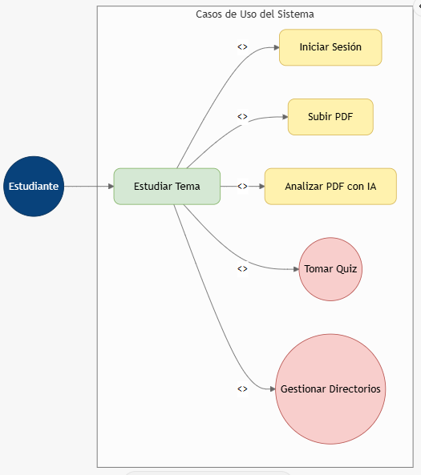
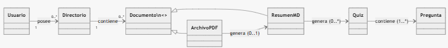

{width="1.1468744531933508in"
height="1.4375in"}

**UNIVERSIDAD PRIVADA DE TACNA**

**FACULTAD DE INGENIERÍA**

**Escuela Profesional de Ingeniería de Sistemas**

**\
**

**"Proyecto *EvoLearn"***

**Curso:**

*Patrones de Software*

**Docente:**

*Mag. Patrick Cuadros Quiroga\
*

> **Integrantes:**

*Akhtar Oviedo, Ahmed Hasan - (2022074261)*

*Anampa Pancca, David Jordan - (2022074268)*

*Salas Jimenez, Walter Emmanuel - (2022073896)*

**Tacna -- Perú**

*2025*

  ----------- ------------- ---------- ---------- ---------- -------------------
  CONTROL DE                                                 
  VERSIONES                                                  

  Versión     Hecha por     Revisada   Aprobada   Fecha      Motivo
                            por        por                   

  1.0         AHAO, DJAP,   PCQ        \-         17/09/25   Versión 1.0
              WESJ                                           
  ----------- ------------- ---------- ---------- ---------- -------------------

# ** **

**Proyecto EvoLearn**

**Documento de Especificación de Requerimientos de Software**

**Versión *1.0***

> []{#_heading=h.6xkuqvg4p4em .anchor}**ÍNDICE GENERAL**

[ÍNDICE GENERAL 3](#_heading=h.6xkuqvg4p4em)

[1. Generalidades de la empresa 5](#_heading=h.1fob9te)

> [1.1. Nombre de la Empresa 5](#nombre-de-la-empresa)
>
> [1.2. Visión 5](#_heading=h.2et92p0)
>
> [1.3. Misión 5](#_heading=h.tyjcwt)
>
> [1.4. Organigrama 5](#_heading=h.3dy6vkm)

[2. Visionamiento de la Empresa 6](#_heading=h.cfdbh0ikj4py)

> [2.1. Descripción del Problema 6](#descripción-del-problema)
>
> [2.2. Objetivos de Negocios 6](#_heading=h.dhmt6uwetjpz)
>
> [2.3. Objetivos de Diseño 7](#objetivos-de-diseño)
>
> [2.4. Alcance del Proyecto
> 8](#alcance-del-proyecto-el-proyecto-se-implementará-inicialmente-como-una-aplicación-móvil-para-android.-el-mvp-demuestra-la-cadena-de-valor-completa)
>
> [2.5. Viabilidad del Sistema 8](#viabilidad-del-sistema)
>
> [2.5.1. Viabilidad Técnica 8](#viabilidad-técnica)
>
> [2.5.2. Viabilidad Económica 10](#viabilidad-económica)
>
> [2.5.3. Viabilidad Operativa 12](#viabilidad-operativa)
>
> [2.5.4. Viabilidad Legal 13](#viabilidad-legal)
>
> [2.5.5. Viabilidad Social 15](#viabilidad-social)
>
> [2.5.6. Viabilidad Ambiental 16](#viabilidad-ambiental)
>
> [2.6. Información obtenida del Levantamiento de Información
> 18](#_heading=h.hp1rzpcout9c)

[3. Análisis de Procesos 19](#_heading=h.hp1rzpcout9c)

> [3.1. Diagrama del Proceso Actual 19](#diagrama-del-proceso-actual)
>
> [3.2. Diagrama del Proceso Propuesto
> 20](#diagrama-del-proceso-propuesto)

[4. Especificación de Requerimientos de Software
22](#_heading=h.u0uokb3cdnz8)

> [4.1. Cuadro de Requerimientos Obtenidos
> 22](#cuadro-de-requerimientos-obtenidos)
>
> [4.2. Cuadro de Requerimientos Funcionales
> 23](#cuadro-de-requerimientos-funcionales)
>
> [4.3. Cuadro de Requerimientos No Funcionales
> 25](#cuadro-de-requerimientos-no-funcionales)
>
> [4.4. Reglas de Negocio\
> Tabla 4: Cuadro de Reglas de Negocio. Fuente de origen: Propia.
> 26](#_heading=h.32ra9w7oz28u)

[5. Fase de Desarrollo 29](#_heading=h.expxnqnpnwvw)

> [5.1. Perfiles de Usuario
> 29](#perfiles-de-usuario-en-esta-primera-entrega-el-aplicativo-se-utiliza-principalmente-en-el-punto-de-control-de-las-campañas-para-verificar-de-forma-rápida-y-clara-la-participación-estudiantil-sin-conexión-a-internet.-participan-tres-perfiles-coordinación-operativa-estudiante-voluntario-y-evaluador-rsudocente.)
>
> [5.1.1. Estudiante
> 29](#perfiles-de-usuario-en-esta-primera-entrega-el-aplicativo-se-utiliza-principalmente-en-el-punto-de-control-de-las-campañas-para-verificar-de-forma-rápida-y-clara-la-participación-estudiantil-sin-conexión-a-internet.-participan-tres-perfiles-coordinación-operativa-estudiante-voluntario-y-evaluador-rsudocente.)
>
> [5.1.2. Mentor 29](#_heading=h.acdhwufnhpe9)
>
> [5.1.3. Docente Encargado 30](#_heading=h.or3g3emdyuaf)
>
> [5.2. Modelo Conceptual 31](#_heading=h.tu14ejx3zcdo)
>
> [5.2.1. Diagrama de Paquetes 31](#_heading=h.ses1b3fci5lg)
>
> [Comentario: Tenemos el diagrama de paquetes del Sistema Web AMS.
> 31](#_heading=h.3x0kaa90hyax)
>
> [Comentario: Tenemos el diagrama de paquetes del Sistema Escritorio
> AMS. 32](#_heading=h.rxwb4twjpu7y)
>
> [5.2.2. Diagrama de Casos de Uso 33](#_heading=h.wjsnnaxqso62)
>
> [Comentario: Tenemos el diagrama de Casos de Uso del Sistema
> Escritorio AMS. 33](#_heading=h.i6c4ql3uhzdu)
>
> [5.2.3. Escenarios de Caso de Uso (Narrativa)
> 35](#_heading=h.9nciw2aa5n0x)
>
> [5.3. Modelo Lógico 47](#modelo-lógico)
>
> [5.3.1. Analisis de Objetos 47](#analisis-de-objetos)
>
> [5.3.2. Diagrama de Secuencia 49](#_heading=h.kklcr44g4lq2)
>
> [5.3.3. Diagrama de Clases 53](#_heading=h.cosq6z5a9ivf)

[CONCLUSIÓN 56](#_heading=h.dywxh6tz9eqh)

[RECOMENDACIONES 57](#_heading=h.cgfxgb2lacqc)

**Documento de Especificación de Requerimientos de Software**

1.  []{#_heading=h.1fob9te .anchor}**Generalidades de la empresa**

    1.  ## Nombre de la Empresa

> EvoLearn: Empresa de ayuda en la gestion estudiantil.

## Visión

> Convertirse en la herramienta móvil de referencia para la gestión, el
> análisis y la evaluación del material de estudio digital entre la
> comunidad estudiantil de habla hispana, integrando la organización de
> archivos con capacidades avanzadas de Inteligencia Artificial (IA)
> para incentivar el aprendizaje activo.

## Misión

> Transformar la manera en que los estudiantes abordan el estudio y la
> preparación, brindando una herramienta que automatice el resumen de
> documentos y genere evaluaciones interactivas (quizzes), facilitando
> así la comprensión profunda y la retención del conocimiento a partir
> de archivos estático.

2.  **Visionamiento de la Empresa**

    1.  ## Descripción del Problema

-   Actualmente, los estudiantes enfrentan dificultades para repasar o
    realizar resúmenes de manera eficiente, invirtiendo grandes
    cantidades de tiempo en leer extensos PDFs y redactar síntesis
    manualmente.

-   La falta de una herramienta organizada y centralizada genera
    limitaciones para un estudio estructurado. Además, la ausencia de
    mecanismos de autoevaluación estandarizados dificulta medir el
    progreso antes de un examen.

-   El MVP aborda esta problemática ofreciendo una aplicación que
    organiza documentos, los resume mediante IA y genera cuestionarios
    automáticos para validar el aprendizaje.

    1.  ## Objetivos de Negocios 

```{=html}
<!-- -->
```
-   **Transformar el estudio:** Cambiar la experiencia de estudio pasiva
    a una activa y automatizada mediante IA.

-   **Eficiencia:** Reducir el tiempo que el usuario invierte en tareas
    de resumen manual y búsqueda de información.

-   **Mejora Académica:** Proveer entregables clave (resúmenes .md y
    quizzes) que sirvan como evidencia de progreso y mejoren la
    retención.

-   **Validación Técnica:** Demostrar la viabilidad de integrar análisis
    de texto con IA (Gemini/LLMs) en un flujo móvil funcional.

    1.  ## Objetivos de Diseño 

```{=html}
<!-- -->
```
-   **Organización Estructurada:** Sistema de directorios flexible para
    gestionar PDFs y archivos generados.

-   **Velocidad de Procesamiento:** Capacidad de subir un PDF y generar
    un resumen en menos de 1 minuto.

-   **Usabilidad:** Interfaz intuitiva con una satisfacción superior al
    85% en pruebas piloto.

-   **Fiabilidad de la IA:** Tasa de éxito igual o mayor al 95% en la
    generación de resúmenes y quizzes contextualmente correctos.

-   **Retroalimentación Educativa:** Inclusión de justificaciones (\"el
    porqué\") en las respuestas de los quizzes.

    1.  ## Alcance del Proyecto El proyecto se implementará inicialmente como una aplicación móvil para Android. El MVP demuestra la cadena de valor completa:

1.  **Autenticación:** Registro e inicio de sesión.

2.  **Gestión:** Creación de directorios y subida exclusiva de PDFs.

3.  **Análisis IA:** Generación de resúmenes (generales/detallados) en
    > formato Markdown (.md).

4.  **Evaluación:** Generación y toma de quizzes con revisión de
    > respuestas explicada.

> *Fuera del alcance del MVP:* Soporte para archivos no-PDF,
> funcionalidad offline para la *generación* (requiere internet para la
> IA), y sincronización en la nube multi-dispositivo.

1.  ## Viabilidad del Sistema 

    1.  ### Viabilidad Técnica

-   **Tecnología Disponible:** Uso de tecnologías móviles modernas
    (Android/Flutter/Kotlin) y APIs de Inteligencia Artificial
    Generativa (ej. Gemini API) para el procesamiento de texto.

-   **Capacidades del Equipo:** El equipo posee conocimientos en
    desarrollo móvil y consumo de APIs REST, necesarios para conectar la
    app con el motor de IA.

-   **Infraestructura:** Se requiere conexión a internet estable para el
    análisis. El almacenamiento local de archivos .md es ligero y
    eficiente.

    1.  ### Viabilidad Económica

```{=html}
<!-- -->
```
-   El costo estimado del MVP es de S/. 4,381.00, cubriendo costos
    generales, operativos (consumo de API, servicios básicos) y la
    valoración del tiempo del personal de desarrollo.

    1.  **Análisis Costo-Beneficio:** La inversión es moderada comparada
        con el valor generado en ahorro de tiempo para el estudiante y
        la potencial escalabilidad del producto en el mercado EdTech.

        1.  ### Viabilidad Operativa

```{=html}
<!-- -->
```
-   **Aceptación:** Responde directamente a una necesidad crítica (falta
    de tiempo para estudiar). Se espera una alta tasa de adopción por
    parte de estudiantes universitarios.

-   **Facilidad de Uso:** La interfaz se diseña para ser intuitiva,
    reduciendo la curva de aprendizaje mediante flujos claros (Subir -\>
    Analizar -\> Quiz).

-   **Mantenibilidad:** El uso de contenedores (Docker) y arquitectura
    modular facilita futuras actualizaciones.

    1.  ### Viabilidad Legal

```{=html}
<!-- -->
```
-   **Protección de Datos:** El MVP no almacena datos sensibles; solo
    credenciales de acceso y documentos académicos. Cumple con
    principios básicos de privacidad al restringir el acceso solo al
    usuario autenticado.

-   **Propiedad Intelectual:** El software se desarrolla bajo un modelo
    académico. Para el uso de APIs de terceros (IA), se respetarán los
    términos de servicio correspondientes.

    1.  ### Viabilidad Social

```{=html}
<!-- -->
```
-   **Impacto Educativo:** Fomenta un aprendizaje activo y organizado.
    Ayuda a estudiantes con dificultades para sintetizar información a
    mejorar su rendimiento académico.

-   **Accesibilidad:** Democratiza el acceso a herramientas de estudio
    avanzadas (IA) para estudiantes de habla hispana.

    1.  ### Viabilidad Ambiental

```{=html}
<!-- -->
```
-   **Digitalización:** Promueve el estudio digital, reduciendo la
    necesidad de imprimir lecturas, diapositivas o exámenes de práctica,
    disminuyendo así el uso de papel y tinta.

3.  []{#_heading=h.hp1rzpcout9c .anchor}**Análisis de Procesos\
    **

    1.  ## Diagrama del Proceso Actual

> Figura 2: Diagrama del Proceso Actual. Fuente de Origen: Propia.
>
> Descripción: El diagrama de procesos actual

## Diagrama del Proceso Propuesto

> Figura 3: Diagrama del Proceso Propuesto - Parte 1. Fuente de Origen:
> Propia.
>
> Figura 4: Diagrama del Proceso Propuesto - Parte 2. Fuente de Origen:
> Propia.

4.  []{#_heading=h.u0uokb3cdnz8 .anchor}**Especificación de
    Requerimientos de Software\
    **

    1.  ## Cuadro de Requerimientos Obtenidos

> Tabla 1: Cuadro de Requerimientos Funcionales Inicial. Fuente de
> origen: Propia.

  ---------------------------------------------------------------------------------
  **ID**           **Descripción**            **Prioridad**   **Criterio de
                                                              Aceptación
                                                              (Resumen)**
  ---------------- -------------------------- --------------- ---------------------
  **RF-AUTH-01**   **Registro e Inicio de     Alta            Acceso exitoso a la
                   Sesión:** El sistema debe                  pantalla principal
                   permitir crear una cuenta                  solo con credenciales
                   y autenticarse para                        válidas.
                   acceder a los archivos                     
                   privados. ^37^                             

  **RF-GEST-01**   **Gestión de               Alta            Las carpetas se crean
                   Directorios:** El usuario                  y visualizan
                   podrá crear, renombrar,                    correctamente en la
                   mover y eliminar carpetas                  estructura.
                   para organizar sus cursos.                 

  **RF-FILE-01**   **Carga de Archivos:**     Alta            Solo se permite PDF;
                   Permitir subir                             error al intentar
                   exclusivamente archivos en                 subir otro formato.
                   formato PDF al directorio                  
                   seleccionado.                              

  **RF-IA-01**     **Generación de Resumen:** Alta            Se crea un archivo
                   Analizar el PDF mediante                   .md legible con la
                   IA y generar un archivo                    síntesis del
                   .md con el resumen                         contenido.
                   (General o Detallado).                     

  **RF-IA-02**     **Generación de Quiz:**    Alta            Se genera un set de
                   Crear un cuestionario                      preguntas coherentes
                   interactivo basado en el                   con el texto.
                   contenido del archivo .md                  
                   seleccionado.                              

  **RF-EVAL-01**   **Toma de Quiz y           Alta            Al finalizar, muestra
                   Feedback:** Permitir al                    puntaje y
                   usuario responder el quiz                  explicaciones de cada
                   y ver la corrección con la                 pregunta.
                   justificación de la                        
                   respuesta correcta.                        

  **RF-FILE-02**   **Gestión de Archivos:**   Media           Los cambios se
                   Permitir renombrar, mover                  reflejan
                   o eliminar archivos PDF y                  inmediatamente en el
                   .md.                                       almacenamiento.
  ---------------------------------------------------------------------------------

  -------------------------------------------------------------------------------
  **ID**            **Categoría**    **Descripción (Medible)**  **Criterio de
                                                                Aceptación**
  ----------------- ---------------- -------------------------- -----------------
  **RNF-PERF-01**   Rendimiento      **Rapidez de               Cronómetro en
                                     Procesamiento:** Subir PDF pruebas \< 60s.
                                     y generar resumen (.md) en 
                                     menos de **1 minuto** para 
                                     documentos estándar.       

  **RNF-USAB-01**   Usabilidad       **Satisfacción:** Nivel de Encuesta SUS \>
                                     satisfacción superior al   80 puntos.
                                     **85%** en pruebas piloto  
                                     respecto a la claridad de  
                                     la interfaz.               

  **RNF-REL-01**    Fiabilidad       **Precisión IA:** Tasa de  19 de 20 intentos
                                     éxito ≥ **95%** en la      exitosos.
                                     generación de resúmenes y  
                                     quizzes sin errores de     
                                     formato.                   

  **RNF-DISP-01**   Disponibilidad   **Dependencia de Red:** La Mensaje de error
                                     función de análisis y quiz claro si no hay
                                     requiere conexión estable; internet.
                                     el manejo de archivos      
                                     puede ser local.           

  **RNF-SEG-01**    Seguridad        **Privacidad:** No se      Auditoría de base
                                     almacenan datos sensibles  de datos limpia
                                     del usuario más allá de    de PII sensible.
                                     las credenciales y sus     
                                     archivos académicos.       

  **RNF-COMP-01**   Compatibilidad   **Plataforma:** Aplicación APK instala y
                                     funcional en dispositivos  corre en Android
                                     **Android** modernos (gama 10+.
                                     media en adelante).        
  -------------------------------------------------------------------------------

## Cuadro de Requerimientos Funcionales

> Tabla 2: Cuadro de Requerimientos Funcionales. Fuente de origen:
> Propia.

  ---------------------------------------------------------------------------------
  **ID**           **Descripción**            **Prioridad**   **Criterio de
                                                              Aceptación
                                                              (Resumen)**
  ---------------- -------------------------- --------------- ---------------------
  **RF-AUTH-01**   **Registro e Inicio de     Alta            Acceso exitoso a la
                   Sesión:** El sistema debe                  pantalla principal
                   permitir crear una cuenta                  solo con credenciales
                   y autenticarse para                        válidas.
                   acceder a los archivos                     
                   privados.                                  

  **RF-GEST-01**   **Gestión de               Alta            Las carpetas se crean
                   Directorios:** El usuario                  y visualizan
                   podrá crear, renombrar,                    correctamente en la
                   mover y eliminar carpetas                  estructura.
                   para organizar sus cursos.                 

  **RF-FILE-01**   **Carga de Archivos:**     Alta            Solo se permite PDF;
                   Permitir subir                             error al intentar
                   exclusivamente archivos en                 subir otro formato.
                   formato PDF al directorio                  
                   seleccionado.                              

  **RF-IA-01**     **Generación de Resumen:** Alta            Se crea un archivo
                   Analizar el PDF mediante                   .md legible con la
                   IA y generar un archivo                    síntesis del
                   .md con el resumen                         contenido.
                   (General o Detallado).                     

  **RF-IA-02**     **Generación de Quiz:**    Alta            Se genera un set de
                   Crear un cuestionario                      preguntas coherentes
                   interactivo basado en el                   con el texto.
                   contenido del archivo .md                  
                   seleccionado.                              

  **RF-EVAL-01**   **Toma de Quiz y           Alta            Al finalizar, muestra
                   Feedback:** Permitir al                    puntaje y
                   usuario responder el quiz                  explicaciones de cada
                   y ver la corrección con la                 pregunta.
                   justificación de la                        
                   respuesta correcta.                        

  **RF-FILE-02**   **Gestión de Archivos:**   Media           Los cambios se
                   Permitir renombrar, mover                  reflejan
                   o eliminar archivos PDF y                  inmediatamente en el
                   .md.                                       almacenamiento.
  ---------------------------------------------------------------------------------

## Cuadro de Requerimientos No Funcionales

> Tabla 3: Cuadro de Requerimientos No Funcionales Final. Fuente de
> origen: Propia.

  -------------------------------------------------------------------------------
  **ID**            **Categoría**    **Descripción (Medible)**  **Criterio de
                                                                Aceptación**
  ----------------- ---------------- -------------------------- -----------------
  **RNF-PERF-01**   Rendimiento      **Rapidez de               Cronómetro en
                                     Procesamiento:** Subir PDF pruebas \< 60s.
                                     y generar resumen (.md) en 
                                     menos de **1 minuto** para 
                                     documentos estándar.       

  **RNF-USAB-01**   Usabilidad       **Satisfacción:** Nivel de Encuesta SUS \>
                                     satisfacción superior al   80 puntos.
                                     **85%** en pruebas piloto  
                                     respecto a la claridad de  
                                     la interfaz.               

  **RNF-REL-01**    Fiabilidad       **Precisión IA:** Tasa de  19 de 20 intentos
                                     éxito ≥ **95%** en la      exitosos.
                                     generación de resúmenes y  
                                     quizzes sin errores de     
                                     formato.                   

  **RNF-DISP-01**   Disponibilidad   **Dependencia de Red:** La Mensaje de error
                                     función de análisis y quiz claro si no hay
                                     requiere conexión estable; internet.
                                     el manejo de archivos      
                                     puede ser local.           

  **RNF-SEG-01**    Seguridad        **Privacidad:** No se      Auditoría de base
                                     almacenan datos sensibles  de datos limpia
                                     del usuario más allá de    de PII sensible.
                                     las credenciales y sus     
                                     archivos académicos.       

  **RNF-COMP-01**   Compatibilidad   **Plataforma:** Aplicación APK instala y
                                     funcional en dispositivos  corre en Android
                                     **Android** modernos (gama 10+.
                                     media en adelante).        
  -------------------------------------------------------------------------------

> []{#_heading=h.32ra9w7oz28u .anchor}

## Reglas de Negocio

> Tabla 4: Cuadro de Reglas de Negocio. Fuente de origen: Propia.

  -----------------------------------------------------------------------------
  **ID**      **Regla de         **Descripción Verificable**     **Relación con
              Negocio**                                          Requisitos**
  ----------- ------------------ ------------------------------- --------------
  **RB-01**   **Exclusividad de  El sistema solo aceptará        RF-FILE-01
              Formato PDF**      archivos con extensión .pdf     
                                 para el análisis. Cualquier     
                                 otro formato debe ser rechazado 
                                 antes de la subida.             

  **RB-02**   **Formato de       Todo resumen generado por la IA RF-IA-01
              Salida Markdown**  debe guardarse obligatoriamente 
                                 en formato .md para asegurar    
                                 ligereza y compatibilidad de    
                                 lectura.                        

  **RB-03**   **Dependencia de   Las funciones de \"Analizar\" y RNF-DISP-01
              Conectividad para  \"Generar Quiz\" no se          
              IA**               ejecutarán si el dispositivo no 
                                 tiene acceso a internet,        
                                 mostrando una alerta al         
                                 usuario.                        

  **RB-04**   **Privacidad de    Los documentos y directorios de RF-AUTH-01
              Documentos**       un usuario solo son accesibles  
                                 por ese usuario autenticado; no 
                                 existe compartición pública en  
                                 el MVP.                         

  **RB-05**   **Feedback         Todo quiz generado debe incluir RF-EVAL-01
              Educativo**        obligatoriamente la explicación 
                                 del porqué de la respuesta      
                                 correcta para fines             
                                 pedagógicos.                    
  -----------------------------------------------------------------------------

5.  []{#_heading=h.expxnqnpnwvw .anchor}**Fase de Desarrollo\
    **

    1.  ## Perfiles de Usuario En esta primera entrega el aplicativo se utiliza principalmente en el punto de control de las campañas para verificar de forma rápida y clara la participación estudiantil sin conexión a internet. Participan tres perfiles: coordinación operativa, estudiante voluntario y evaluador RSU/Docente.

        1.  **Estudiante / Estudioso (Usuario Final)**

-   **Descripción:** Estudiante universitario, escolar o profesional en
    formación continua.

-   **Necesidades:** Organizar material disperso, reducir tiempo de
    lectura, autoevaluarse antes de exámenes.

-   **Interacción:** Sube PDFs, gestiona carpetas, ejecuta el análisis
    de IA, lee resúmenes y responde quizzes.

    1.  **Desarrollador / Admin (Soporte)**

```{=html}
<!-- -->
```
-   **Descripción:** Equipo técnico del proyecto.

-   **Necesidades:** Validar el correcto funcionamiento de la API de IA,
    monitorear errores de conexión y asegurar la estabilidad de la app.

[]{#_heading=h.tu14ejx3zcdo .anchor}

1.  ## Modelo Conceptual 

    1.  []{#_heading=h.ses1b3fci5lg .anchor}**Diagrama de Casos de Uso
        (Descripción Textual)**

-   **Actores:** Estudiante.

-   **Caso de Uso Principal:** \"Estudiar Tema\".

    -   *Includes:* \"Iniciar Sesión\", \"Subir PDF\", \"Analizar PDF
        con IA\".

    -   *Extends:* \"Tomar Quiz\", \"Gestionar Directorios\".

-   **Flujo:** El estudiante se loguea -\> Crea carpeta \"Historia\" -\>
    Sube \"Guerra_Pacifico.pdf\" -\> Clic en \"Analizar\" -\> Sistema
    crea \"Resumen_Guerra.md\" -\> Estudiante abre \"Resumen_Guerra.md\"
    -\> Clic en \"Crear Quiz\" -\> Sistema muestra preguntas.

> {width="5.46951334208224in"
> height="6.1779451006124235in"}

**\
**

1.  **Prototipos de Interfaz (Descripción de Mockups)**

-   **M-01 Login:** Pantalla limpia con campos de correo/contraseña y
    botón de registro.

-   **M-02 Home (Directorios):** Vista de carpetas (grid/list) con botón
    flotante (+) para crear directorio o subir PDF. Barra de navegación
    inferior.

-   **M-03 Vista Documento:** Visualizador de PDF o lector de Markdown
    con opciones en la barra superior (\"Analizar\" si es PDF, \"Quiz\"
    si es MD).

-   **M-04 Quiz:** Pantalla interactiva con la pregunta, opciones
    múltiples, y retroalimentación inmediata (color verde/rojo) con
    texto explicativo al seleccionar una respuesta^58585858^.

    1.  ## Modelo Lógico 

        1.  ### Analisis de Objetos

```{=html}
<!-- -->
```
-   **Usuario:** Gestiona la autenticación y es dueño de los
    directorios.

-   **Directorio:** Contenedor lógico de archivos.

-   **Documento:** Clase padre.

    1.  **ArchivoPDF:** Documento fuente subido por el usuario.

    2.  **ResumenMD:** Documento generado por la IA, vinculado al PDF
        original.

-   **Quiz:** Objeto generado a partir de un ResumenMD.

-   **Pregunta:** Componente del Quiz, contiene enunciado, opciones y
    justificación.

> {width="5.905555555555556in"
> height="0.6416666666666667in"}

[]{#_heading=h.kklcr44g4lq2 .anchor}

1.  ### Diagrama de Secuencia

    1.  Diagrama de Secuencia Principal -- "Estudiar Tema"

> {width="5.905555555555556in"
> height="7.146527777777778in"}

[]{#_heading=h.cosq6z5a9ivf .anchor}

### Diagrama de Clases

> {width="5.905555555555556in"
> height="6.961111111111111in"}

[]{#_heading=h.dywxh6tz9eqh .anchor}**\
**

> **CONCLUSIÓN**
>
> El presente SRS define el alcance del MVP de **EvoLearn**, una
> solución móvil viable técnica y económicamente que integra gestión
> documental e Inteligencia Artificial. Al delimitar las funciones de
> análisis y evaluación automática, se establece una base sólida para
> mejorar la eficiencia del estudio, cumpliendo con los estándares de
> calidad y usabilidad requeridos para el ámbito académico.
>
> []{#_heading=h.cgfxgb2lacqc .anchor}**RECOMENDACIONES\
> **

-   **Validación de IA:** Realizar pruebas exhaustivas con PDFs de
    diversas temáticas para calibrar la precisión de los resúmenes y
    preguntas generadas^60^.

-   **Enfoque en UX:** Priorizar la claridad en la retroalimentación del
    quiz (\"el porqué\") para asegurar el valor pedagógico^61^.

-   **Escalabilidad:** Planificar la arquitectura para soportar modo
    offline de lectura y sincronización en la nube en versiones
    futuras^62^.
