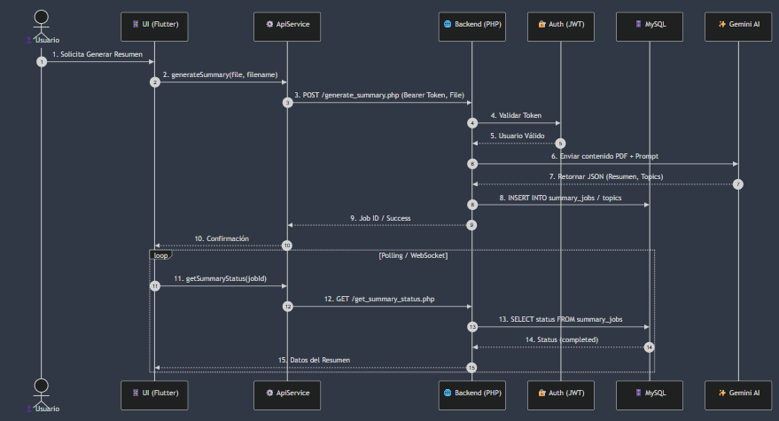
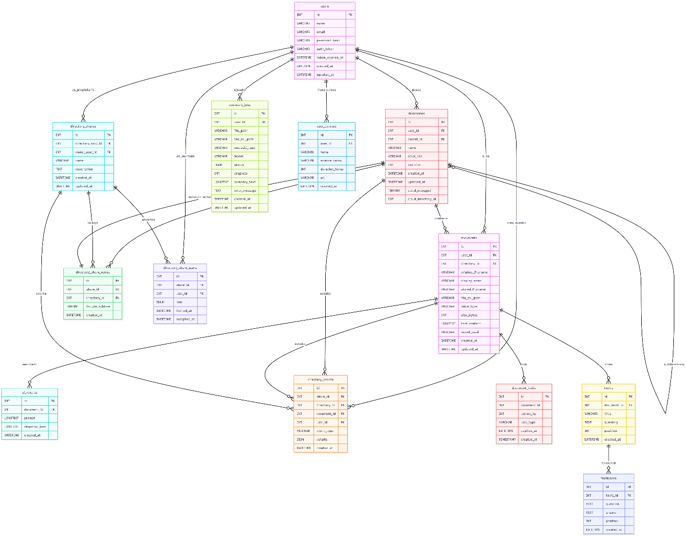
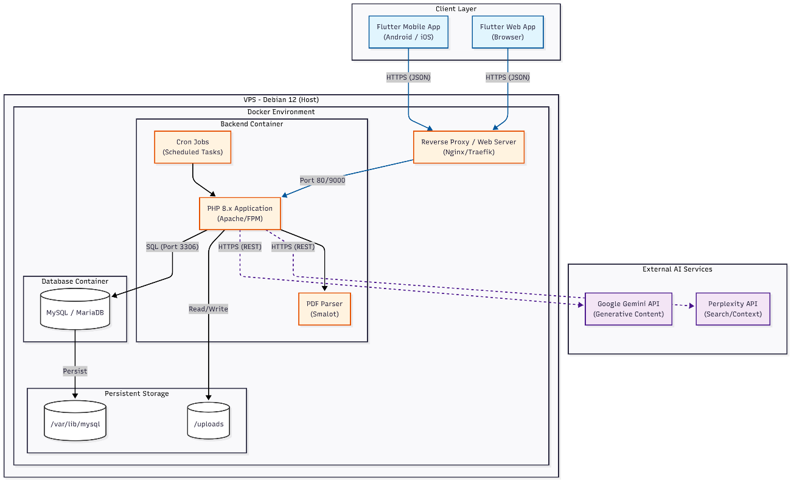

{width="1.0926727909011373in"
height="1.468837489063867in"}

**UNIVERSIDAD PRIVADA DE TACNA**

**FACULTAD DE INGENIERÍA**

**Escuela Profesional de Ingeniería de Sistemas**

**"Proyecto *EvoLearn"***

**Curso:**

*Patrones de Software*

**Docente:**

*Mag. Patrick Cuadros Quiroga\
*

> **Integrantes:**

*Akhtar Oviedo, Ahmed Hasan - (2022074261)*

*Anampa Pancca, David Jordan - (2022074268)*

*Salas Jimenez, Walter Emmanuel - (2022073896)*

**Tacna -- Perú**

*2025*

  ----------- ------------- ---------- ---------- ---------- -------------------
  CONTROL DE                                                 
  VERSIONES                                                  

  Versión     Hecha por     Revisada   Aprobada   Fecha      Motivo
                            por        por                   

  1.0         AHAO, DJAP,   PCQ        \-         17/09/25   Versión 1.0
              WESJ                                           
  ----------- ------------- ---------- ---------- ---------- -------------------

# ** **

**Proyecto *EvoLearn***

**Documento de Arquitectura de Software**

**Versión *1.0***

  ----------- ------------- ---------- ---------- ---------- -------------------
  CONTROL DE                                                 
  VERSIONES                                                  

  Versión     Hecha por     Revisada   Aprobada   Fecha      Motivo
                            por        por                   

  1.0         AHAO, DJAP,   PCQ        \-         17/09/25   Versión 1.0
              WESJ                                           
  ----------- ------------- ---------- ---------- ---------- -------------------

ÍNDICE GENERAL

**Contenido**

[***1.*** ***INTRODUCCIÓN 5***](#_heading=h.tjgvbx7ihkut)

> [**1.1.** **Propósito (Diagrama 4+1) 5**](#_heading=h.47gjskb673gv)
>
> [**1.2.** **Alcance 5**](#_heading=h.u63ijdma55dt)
>
> [**1.3.** **Definición, siglas y abreviaturas
> 5**](#_heading=h.3qfbwx91mir2)
>
> [**1.4.** **Organización del documento 5**](#_heading=h.wi1nmmq6qrai)

[***2.*** ***OBJETIVOS Y RESTRICCIONES ARQUITECTONICAS
5***](#objetivos-y-restricciones-arquitectonicas)

> [2.1.1. Requerimientos Funcionales 5](#requerimientos-funcionales)
>
> [2.1.2. Requerimientos No Funcionales -- Atributos de Calidad
> 5](#_heading=h.zejh9za72x00)

[***3.*** ***REPRESENTACIÓN DE LA ARQUITECTURA DEL SISTEMA
6***](#_heading=h.3ru7upqjjejm)

> [**3.1.** **Vista de Caso de uso 6**](#_heading=h.1zp4nrvpybj3)
>
> [3.1.1. Diagramas de Casos de uso 6](#diagramas-de-casos-de-uso)
>
> [**3.2.** **Vista Lógica 6**](#_heading=h.sh2lg66i9paf)
>
> [3.2.1. Diagrama de Subsistemas (paquetes)
> 7](#diagrama-de-subsistemas-paquetes)
>
> [3.2.2. Diagrama de Secuencia (vista de diseño)
> 7](#_heading=h.wfkuhn49m1g)
>
> [3.2.3. Diagrama de Colaboración (vista de diseño)
> 7](#_heading=h.clb6so2dqazv)
>
> [3.2.4. Diagrama de Objetos 7](#diagrama-de-objetos)
>
> [3.2.5. Diagrama de Clases 7](#_heading=h.yf7oqnx8f6db)
>
> [3.2.6. Diagrama de Base de datos (relacional o no relacional)
> 7](#diagrama-de-base-de-datos)
>
> [**3.3.** **Vista de Implementación (vista de desarrollo)
> 7**](#_heading=h.m6eb6sy30d02)
>
> [3.3.1. Diagrama de arquitectura software (paquetes)
> 7](#diagrama-de-arquitectura-software-paquetes)
>
> [3.3.2. Diagrama de arquitectura del sistema (Diagrama de componentes)
> 7](#_heading=h.fleswk17xneb)
>
> [**3.4.** **Vista de procesos 7**](#_heading=h.fje16axaqov8)
>
> [3.4.1. Diagrama de Procesos del sistema (diagrama de actividad)
> 8](#diagrama-de-procesos-del-sistema-diagrama-de-actividad)
>
> [**3.5.** **Vista de Despliegue (vista física)
> 8**](#_heading=h.omgbzp9xgimi)
>
> [3.5.1. Diagrama de despliegue 8](#diagrama-de-despliegue)

[***4.*** ***ATRIBUTOS DE CALIDAD DEL SOFTWARE
8***](#_heading=h.iiod06kmgyh6)

> [**Escenario de Funcionalidad 8**](#_heading=h.vic8ny3jb3vf)
>
> [**Escenario de Usabilidad 8**](#_heading=h.87548ebqp1eq)
>
> [**Escenario de confiabilidad 9**](#_heading=h.iflnryim5v2u)
>
> [**Escenario de rendimiento 9**](#_heading=h.jtrgspli7s8i)
>
> [**Escenario de mantenibilidad 9**](#_heading=h.gl03w3njcogs)
>
> [**Otros Escenarios 9**](#_heading=h.tk658c5siahw)

[]{#_heading=h.tjgvbx7ihkut .anchor}

1.  INTRODUCCIÓN

> El presente documento describe la arquitectura de software del
> proyecto EvoLearn, una solución móvil innovadora diseñada para
> transformar la experiencia de estudio mediante la integración de
> gestión documental e Inteligencia Artificial.
>
> EvoLearn nace de la necesidad de los estudiantes de optimizar el
> tiempo dedicado a resumir y repasar material extenso en formato PDF.
> Actualmente, el proceso manual es ineficiente y carece de mecanismos
> de autoevaluación inmediatos . La arquitectura aquí planteada busca
> soportar una plataforma escalable, segura y modular que automatice la
> generación de resúmenes (.md) y cuestionarios interactivos (quizzes),
> proporcionando retroalimentación pedagógica instantánea .
>
> Este documento servirá como guía para el equipo de desarrollo,
> asegurando que la construcción del sistema cumpla con los atributos de
> calidad de rendimiento, usabilidad y fiabilidad definidos en la fase
> de análisis.

[]{#_heading=h.47gjskb673gv .anchor}

1.  Propósito (Diagrama 4+1)

> {width="5.905555555555556in"
> height="2.5388888888888888in"}

2.  []{#_heading=h.u63ijdma55dt .anchor}Alcance

El alcance de la arquitectura para el MVP de EvoLearn comprende:

-   **Plataforma Móvil:** Arquitectura nativa o híbrida para Android.

-   **Gestión Local:** Estructura de archivos y base de datos ligera en
    el dispositivo.

-   **Integración IA:** Comunicación REST segura con servicios de IA
    (Gemini API) para análisis de texto.

-   **Módulos:** Autenticación básica, Gestor de Archivos (PDF/MD),
    Visualizador Markdown y Motor de Quizzes interactivos.

-   **Exclusiones:** No incluye sincronización en la nube
    multi-dispositivo ni soporte para archivos que no sean PDF en esta
    fase

    1.  []{#_heading=h.3qfbwx91mir2 .anchor}Definición, siglas y
        abreviaturas

```{=html}
<!-- -->
```
-   API (Application Programming Interface): Interfaz que permite la
    comunicación entre el móvil y el servicio de IA.

-   IA (Inteligencia Artificial): Se refiere a los modelos de lenguaje
    (LLM) usados para resumir.

-   MVP (Producto Mínimo Viable): Versión funcional inicial del sistema.

-   Markdown (.md): Formato de texto ligero utilizado para guardar los
    resúmenes generados.

-   PDF: Formato de documento portátil, única entrada permitida en el
    MVP.

-   Quiz: Cuestionario interactivo generado automáticamente.

-   SRS: Especificación de Requerimientos de Software.

    1.  Organización del documento

> El documento está organizado en secciones que cubren desde los
> objetivos arquitectónicos hasta las vistas detalladas (Lógica,
> Implementación, Procesos, Despliegue) y la evaluación de atributos de
> calidad.

# **OBJETIVOS Y RESTRICCIONES ARQUITECTONICAS**

> \[Establezca las prioridades de los requerimientos y las restricciones
> del proyecto)

1.  Priorización de requerimientos

    1.  ### Requerimientos Funcionales

  --------------------------------------------------------------------------
  ID           Requerimiento      Concepto                           Nivel
  ------------ ------------------ ---------------------------------- -------
  RF-AUTH-01   Registro e Inicio  El sistema debe gestionar sesiones Alto
               de Sesión          de usuario de forma segura         
                                  localmente.                        

  RF-GEST-01   Gestión de         Arquitectura capaz de manipular el Alto
               Directorios        sistema de archivos (CRUD de       
                                  carpetas).                         

  RF-FILE-01   Carga de Archivos  Validación y almacenamiento        Alto
                                  optimizado de archivos PDF.        

  RF-IA-01     Generación de      Integración con servicio externo   Alto
               Resumen            de IA para transformar PDF a       
                                  Markdown.                          

  RF-IA-02     Generación de Quiz Lógica para parsear contenido y    Alto
                                  estructurar objetos \"Pregunta\" y 
                                  \"Quiz\".                          

  RF-EVAL-01   Toma de Quiz y     Interfaz interactiva con lógica de Alto
               Feedback           evaluación inmediata y             
                                  justificación.                     
  --------------------------------------------------------------------------

[]{#_heading=h.zejh9za72x00 .anchor}

### Requerimientos No Funcionales -- Atributos de Calidad

  ---------------------------------------------------------------------------
  ID            Requerimiento    Concepto                             Nivel
  ------------- ---------------- ------------------------------------ -------
  RNF-PERF-01   Rendimiento      Procesamiento de análisis y          Alto
                                 generación en \< 1 minuto.           

  RNF-USAB-01   Usabilidad       Interfaz intuitiva con satisfacción  Alto
                                 \> 85%.                              

  RNF-REL-01    Fiabilidad       Tasa de éxito de la IA ≥ 95% con     Alto
                                 manejo de errores robusto.           

  RNF-DISP-01   Disponibilidad   Manejo elegante de la falta de       Alto
                                 conectividad (modo offline parcial). 

  RNF-SEG-01    Seguridad        Privacidad de datos locales; sin     Alto
                                 envío de datos sensibles personales. 

  RNF-COMP-01   Compatibilidad   Arquitectura compatible con Android  Alto
                                 moderno (API 29+).                   
  ---------------------------------------------------------------------------

2.  Restricciones

-   **Conectividad: Las funciones de IA (Análisis y Quiz) dependen
    estrictamente de internet.**

-   **Formato: Limitado exclusivamente a archivos PDF en el MVP.**

-   **Plataforma: Exclusivo para sistema operativo Android.**

-   **Costos: Uso de APIs de IA que pueden tener límites de cuota o
    costos por token.**

[]{#_heading=h.3ru7upqjjejm .anchor}**\
**

# **REPRESENTACIÓN DE LA ARQUITECTURA DEL SISTEMA**

> []{#_heading=h.1zp4nrvpybj3 .anchor}

1.  Vista de Caso de uso

> Esta vista presenta las funcionalidades centrales desde la perspectiva
> del estudiante, guiando el diseño de la arquitectura.

### Diagramas de Casos de uso

> {width="4.355743657042869in"
> height="4.919915791776028in"}

[]{#_heading=h.sh2lg66i9paf .anchor}

2.  Vista Lógica

    1.  ### Diagrama de Subsistemas (paquetes)

{width="6.479166666666667in"
height="6.210980971128609in"}

### Diagrama de Secuencia (vista de diseño)

> Flujo principal del estudiante para Estudiar un tema
>
> {width="5.905555555555556in"
> height="7.145833333333333in"}

[]{#_heading=h.clb6so2dqazv .anchor}

### Diagrama de Colaboración (vista de diseño)

> {width="5.905555555555556in"
> height="3.1909722222222223in"}

### Diagrama de Objetos

> {width="2.833221784776903in"
> height="4.502020997375328in"}

[]{#_heading=h.yf7oqnx8f6db .anchor}

### Diagrama de Clases

> {width="3.2728904199475064in"
> height="5.16961176727909in"}

### Diagrama de Base de datos

> {width="6.395833333333333in"
> height="5.00219706911636in"}

###  

3.  Vista de Implementación (vista de desarrollo)

    1.  ### Diagrama de arquitectura software (paquetes)

> {width="2.2034317585301837in"
> height="7.065617891513561in"}

[]{#_heading=h.fleswk17xneb .anchor}

### Diagrama de arquitectura del sistema (Diagrama de componentes)

> {width="5.905555555555556in"
> height="3.598611111111111in"}

[]{#_heading=h.fje16axaqov8 .anchor}

4.  Vista de procesos

    1.  ### Diagrama de Procesos del sistema (diagrama de actividad)

{width="3.6775962379702536in"
height="7.167667322834646in"}

[]{#_heading=h.omgbzp9xgimi .anchor}

5.  Vista de Despliegue (vista física)

    1.  ### Diagrama de despliegue

> {width="5.905555555555556in"
> height="6.365277777777778in"}

[]{#_heading=h.iiod06kmgyh6 .anchor}**\
**

# **ATRIBUTOS DE CALIDAD DEL SOFTWARE**

**Escenario de Funcionalidad**

-   **Descripción:** El sistema debe ser capaz de procesar documentos
    académicos complejos y generar contenido educativo coherente y
    estructurado.

-   **Estímulo:** El usuario sube un archivo PDF con contenido académico
    denso y selecciona la opción \"Analizar con IA\".

-   **Respuesta:** El sistema valida el formato, extrae el texto, lo
    procesa mediante la API de Gemini y genera un archivo Markdown (.md)
    con un resumen estructurado, sin corromper la información original.

-   **Medida:** El resumen generado cubre los puntos clave del documento
    original y el formato del archivo de salida es válido para su
    visualización.

**Escenario de Usabilidad**

-   **Descripción:** La aplicación debe ser intuitiva para estudiantes,
    permitiendo su uso inmediato sin manuales extensos.

-   **Estímulo:** Un nuevo usuario descarga la aplicación e intenta
    realizar su primer ciclo de estudio (Subir archivo -\> Generar
    Resumen -\> Crear Quiz).

-   **Respuesta:** La interfaz guía al usuario mediante un diseño claro
    (Material Design), botones de acción visibles y retroalimentación
    inmediata ante cada acción.

-   **Medida:** El usuario logra completar el flujo principal en menos
    de 5 minutos desde su primer inicio de sesión, con una tasa de error
    de navegación cercana a cero.

**Escenario de confiabilidad**

-   **Descripción:** El sistema debe manejar los fallos de conectividad
    o de servicios externos sin perder los datos del usuario.

-   **Estímulo:** El usuario intenta generar un quiz, pero la conexión a
    internet se pierde o la API de IA no responde.

-   **Respuesta:** El sistema detecta la falta de conectividad, muestra
    un mensaje de error amigable (\"Verifica tu conexión a internet\") y
    asegura que el archivo de resumen original (.md) no se dañe ni se
    pierda.

-   **Medida:** Integridad de datos locales del 100% ante fallos de red
    y recuperación del estado de la aplicación sin cierres inesperados.

**Escenario de rendimiento**

-   **Descripción:** La velocidad de respuesta es crítica para mantener
    la atención del estudiante durante el proceso de estudio.

-   **Estímulo:** El usuario solicita la generación de un resumen de un
    documento estándar.

-   **Respuesta:** La aplicación inicia el procesamiento en segundo
    plano para no congelar la interfaz de usuario, mostrando un
    indicador de carga.

-   **Medida:** El tiempo de latencia para documentos de tamaño promedio
    (\< 5MB) no excede los 60 segundos, y la navegación entre
    directorios es inferior a 1 segundo.

**Escenario de mantenibilidad**

-   **Descripción:** La arquitectura debe permitir la incorporación de
    nuevas funcionalidades o el cambio de servicios externos con mínimo
    impacto.

-   **Estímulo:** El equipo de desarrollo necesita cambiar el proveedor
    de Inteligencia Artificial (ej. de Gemini a otro modelo) o añadir
    soporte para nuevos formatos.

-   **Respuesta:** Gracias a la arquitectura modular (capas separadas),
    los cambios se realizan únicamente en la capa de datos sin afectar
    la lógica de negocio ni la interfaz.

-   **Medida:** El cambio de proveedor de API se realiza modificando una
    única clase de servicio e inyectando la nueva dependencia.

**Otros Escenarios**

-   **Escenario de Portabilidad (Compatibilidad):**

    -   **Descripción:** EvoLearn debe funcionar correctamente en la
        diversidad de dispositivos Android del mercado.

    -   **Estímulo:** Instalación de la aplicación en dispositivos con
        diferentes versiones de Android (API 29+) y tamaños de pantalla.

    -   **Respuesta:** La interfaz se adapta (diseño responsivo) y las
        funcionalidades operan correctamente respetando los permisos de
        cada versión de SO.

    -   **Medida:** Funcionalidad correcta en el 95% de los dispositivos
        Android activos en el mercado objetivo.
